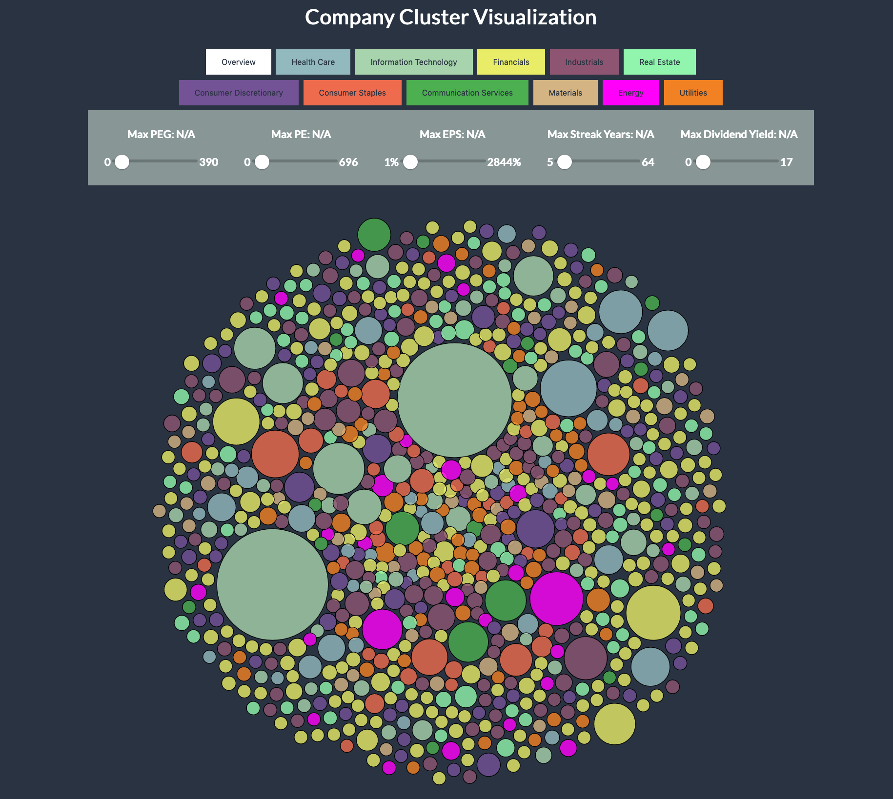

# Company Cluster

Stock market data visualization application using D3.js created by Jayden Laturnus & Komal Aheer for CMPT450 (Data Visualization) at Macewan University.



## Getting Started

```bash
# Clone this repository
git clone https://github.com/company-cluster.git

# Navigate to the location of the repository
cd company-cluster

# Run a local http server using python
python3 -m http.server

# Navigate using any browser
http://localhost:8000/
```

## Features

- Force-directed graph resulting in a interactive visualization where one can drag, click, and highlight companies.

- Filteration on select attributes, sector, or both.

- Click and comparing companies via a line graph and table showing the historical dividend yield and highlighting the best attributes between the two companies.

## Notes

Future improvments will (hopefully) be made during our freetime to update styling, code structure, and overall add new features to this project.

## Credits

DRiP Investing for providing the data used in this visualization, our colleague Brent for creating an api to access the data easily and Macewan University.

## License

MIT

